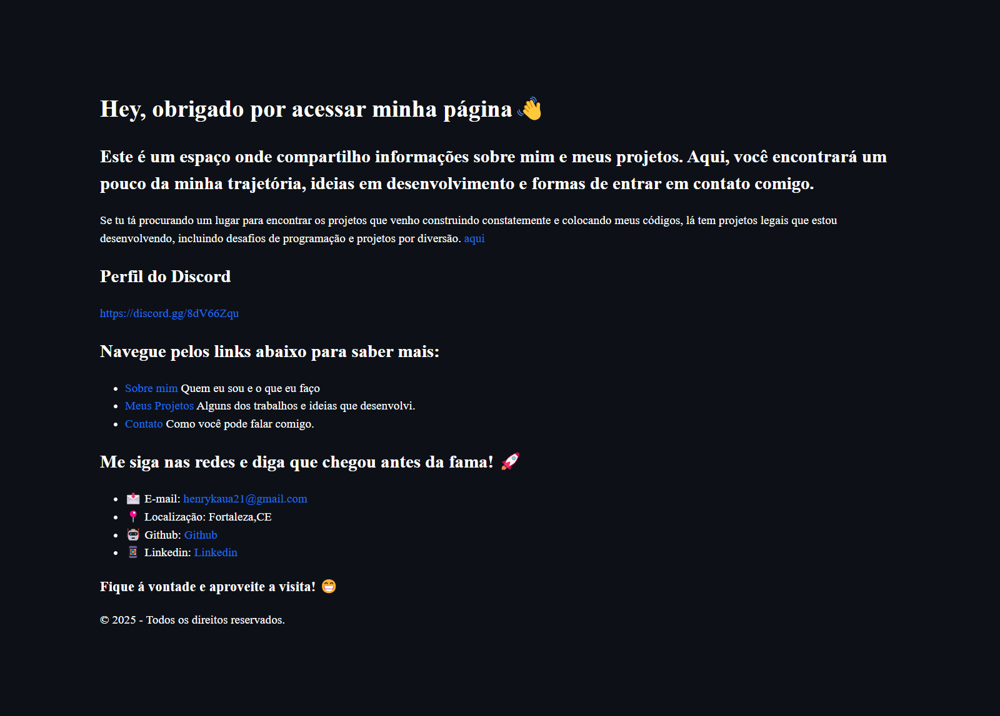

# Projeto Página Pessoal

Projeto feito apenas com HTML para uma atividade em sala de aula, que consistia em criar uma página pessoal com quatro arquivos HTML, cada um com sua responsabilidade. Além disso, precisávamos usar a criatividade para desenvolver o site.

Abaixo está uma imagem com a descrição da atividade proposta:

